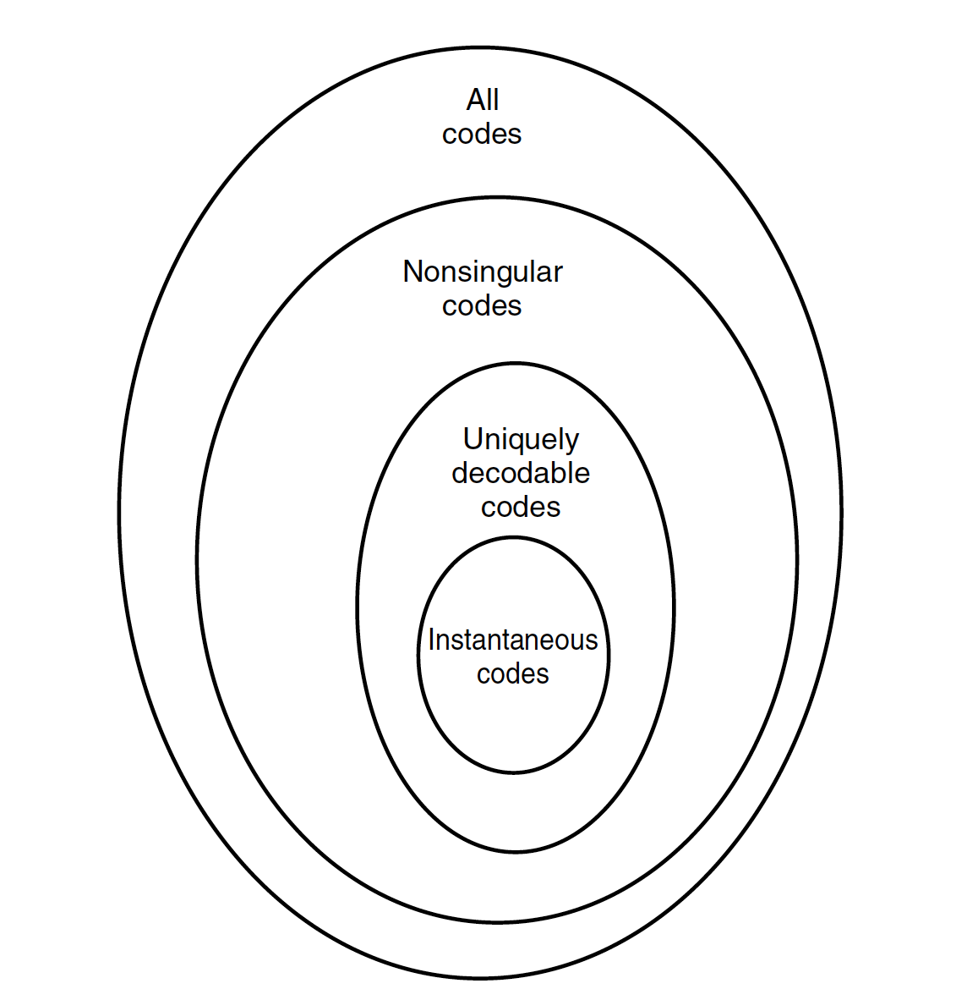

# 绪论

## 什么是信息

* 与消息、信号的区别：
    * 消息：包含有信息的语言、文字、图像等
    * 信号：消息的物理体现，光信号、电信号等等
* 信息与事物运动状态或存在方式的不确定度有关
* 信息与内容本身无关，与事情严重与否更无关系

## 信息的度量

### 熵

平均自信息量
$$
H(X)=-\sum_xp(x)\log p(x)=-E\log p(X)
$$

### 二元熵

$$
H(\gamma)=h_b(\gamma)=-\gamma\log\gamma-(1-\gamma)\log(1-\gamma)
$$

关于$\gamma$的凹（上凸）函数

### 联合熵

$$
H(X, Y)=-\sum_{x, y}p(x, y)\log p(x, y)=-E\log p(x, y)
$$

#### 链式法则

$$
H(X^n)=\sum_{i=1}^nH(X_i|X^{i-1})
$$

### 条件熵

$$
H(Y|X)=-\sum_{x, y}p(x, y)\log p(y|x)=-E\log p(Y|X)=-\sum_{x}p(x)H(Y|X=x)
$$

#### 链式法则

$$
H(X^n|Y)=\sum_{i=1}^nH(X_i|X^{i-1}, Y)
$$

### 互信息

$$
I(X; Y)=\sum_{x, y}p(x, y)\log\frac{p(x, y)}{p(x)p(y)}
$$

* $$
    I(X; X)=H(X)
    $$

* $$
    I(X; Y)=H(X)-H(X|Y)=H(Y)-H(Y|X)
    $$

* $$
    I(X; Y)=H(X)+H(Y)-H(X, Y)
    $$

#### 链式法则

$$
I(X^n; Y)=\sum_{i=1}^nI(X_i; Y|X^{i-1})
$$

### 条件互信息

$$
I(X; Y|Z)=\sum_{x, y, z}p(x, y, z)\log\frac{p(x, y|z)}{p(x|z)p(y|z)}=E\log\frac{p(X, Y|Z)}{p(X|Z)p(Y|Z)}
$$

* $$
    I(X; Y|Z)=H(X|Z)-H(X|Y, Z)
    $$

### 相对熵

$$
D(x\parallel y)=\sum_{x}p(x)\log\frac{p(x)}{q(x)}=E_p\log\frac{p(x)}{q(x)}
$$

### 基础不等式

* $$
    0\leq H(X)\leq \log|\mathcal{X}|
    $$

    RHS当且仅当$X$是均匀分布

* $$
    H(X)\geq H(X|Y)\geq H(X|Y, Z)
    $$

    LHS当且仅当$X$, $Y$独立

* $$
    H(X^n)\leq\sum_{i=1}^nH(X_i)
    $$

    当且仅当所有的$X_i$相互独立

* $$
    H(f(X))\leq H(X)
    $$

    当且仅当$f(x)$是一一映射

* $$
    I(X; Y)\geq I(X; g(Y))
    $$

* $$
    I(X; Y)\geq 0
    $$

    当且仅当$X$, $Y$独立

* $$
    D(p\parallel q)\geq 0
    $$

    当且仅当两个分布独立

* $$
    Ef(x)\geq f(EX)
    $$

    $f$是凸函数时不等式成立

#### 数据处理不等式

对于马尔可夫链$X\to Y\to Z$

* $$
    I(X; Z)\leq I(X; Y)
    $$

* $$
    I(X; Y|Z)\leq I(X; Y)
    $$

* $$
    I(X; Y, Z)= I(X; Y)\geq I(X; Z)
    $$

* $$
    H(X|Z)\geq H(X|Y)
    $$

#### Fano不等式

$$
H(X|\hat{X})<1+P_e\log|\mathcal{X}|
$$

其中
$$
P_e=P(\hat{X}\neq X)
$$

## 样题

### 说明下列命题正确或不出正确，并简要给出理由

#### 随机变量$X$的熵$H(X)>0$

错，对于确定的随机变量$X$, $H(X)=0$

#### 如果$H(X|Y, Z)=0$, 那么有$H(X|Z)=0$或$H(X|Y)=0$

错，如$X=Y^2+Z^2$

#### 如果$X, Y$独立，则有$H(Y|X)=H(X|Y)$

错，因为若$X, Y$独立，则$H(Y|X)=H(Y)$, $H(X|Y)=H(X)$, 而$X, Y$的熵不一定相等

### $I(X; Y)\leq H(Y)$

正确，因为
$$
I(X; Y)=H(Y)-H(Y|X)\leq H(Y)
$$

### 设$X$和$Z$为独立随机变量，$Y=X+Z$, 试求$I(X; Y)$

$$
I(X; Y)=H(Y)-H(Y|X)\\
=H(Y)-H(X+Z|X)\\
=H(Y)-H(Z|X)\\
=H(Y)-H(Z)
$$

### 给出离散随机变量$X, Y$的联合分布，求$Y$的边缘分布、$H(Y)$、$Y$的条件分布、$H(Y|X)$

### 信源信道分离定理证明中包含以下步骤，是说明各步骤理由

# 典型集和AEP

## 典型集

$$
A_{\epsilon}^{(n)}=\{\{x_1, x_2,\ldots, x_n\}\mid 2^{-n(H(X)+\epsilon)}\leq p(x_1, x_2,\ldots, x_n)\leq 2^{-n(H(X)-\epsilon)}\}
$$

### 性质

* 典型集的表述
    $$
    H(X)-\epsilon\leq -\frac{1}{n}\log p(x_1, x_2,\ldots, x_n)\leq H(X)+\epsilon
    $$

* 典型集的概率
    $$
    P((x_1, x_2,\ldots, x_n)\in A_{\epsilon}^{(n)})>1-\epsilon
    $$

* 典型集的大小
    $$
    (1-\epsilon)2^{n(H(X)-\epsilon)}\leq |A_{\epsilon}^{(n)}|\leq 2^{n(H(X)+\epsilon)}
    $$

* 大多数序列并不是典型序列

* 高概率序列未必典型

## 样题

### 以下关于典型集的表述，不正确的是

#### 典型集的概率极大

正确，因为
$$
P((x_1, x_2,\ldots, x_n)\in A_{\epsilon}^{(n)})>1-\epsilon
$$

#### 典型集内元素数量极小

正确

#### 若序列$(X^n, Y^n)$联合典型，则它们各自属于典型集

正确，由定义可知。

#### 高概率序列必然典型

错误

# 随机过程熵率

## 熵率

$$
H_X=\lim_{n\to\infty}\frac{1}{n}H(X_1, X_2,\ldots, X_n)\\
H_X'=\lim_{n\to\infty}H(X_n|X_1, X_2,\ldots, X_{n-1})
$$

## 平稳信源

分布不随时间变化

## 马尔可夫信源

$$
p(x_n|x_1, \ldots, x_{n-1})=p(x_n|x_{n-1})
$$

### 性质

$$
p(x_1, x_2,\ldots, x_n)=p(x_1)\prod_{i=2}^np(x_i|x_{i-1})
$$

#### 熵率

$$
H_X=H(X_2|X_1)=-\sum_{ij}\mu_iP_{ij}\log P_{ij}
$$

## 样题

### 二阶马尔可夫过程

设$X^n$为二阶马尔可夫过程：
$$
p(x_1, x_2,\ldots, x_n)=p(x_1)p(x_2|x_1)p(x_3|x_1, x_2)p(x_4|x_2, x_3)\cdots p(x_n|x_{n-2}, x_{n-1})
$$
试化简$I(X_1; X_2,\ldots, X_n)$
$$
I(X_1; X_2,\ldots, X_n)=I(X_1; X_2)+I(X_1; X_3|X_2)+I(X_1; X_4|X_3, X_2)+\cdots +I(X_1; X_n|X_{n-1}, X_{n-2}, \ldots, X_2)\\
=I(X_1; X_2)+I(X_1; X_3|X_2)\\
=I(X_1; X_2, X_3)
$$

### 状态转移矩阵

给定状态转移矩阵$P=\left(\begin{array}{cc}1-p&p\\1&0\end{array}\right)$

#### 求熵率

设$X, Y$的稳态概率分别为$\mu_1, \mu_2$, 则
$$
\begin{cases}\mu_1p=\mu_2\cdot 1\\\mu_1+\mu_2=1\end{cases}
$$
故
$$
\begin{cases}
\mu_1=\frac{1}{1+p}\\
\mu_2=\frac{p}{1+p}
\end{cases}
$$
则
$$
H_X=\mu_1H(X)+\mu_2H(Y)=\frac{H(p)}{1+p}
$$

#### 熵率达到最大时，$p$为多少

$$
\frac{\partial H_X}{\partial p}=\frac{1}{(1+p)^2}\log \frac{(1-p)^2}{p}=0
$$

故
$$
(1-p)^2=p
$$
所以$p=\frac{3-\sqrt{5}}{2}$

# 信源编码

## $D$元码

从信源字符集$\mathcal{X}$向编码集$\mathcal{D}^*$的有限长度的映射

### 码字

$D$元字符构成的有限长序列

### 码长

码字的长度

### 码字期望长度

$$
L=\sum_{x\in\mathcal{X}}p(x)l(x)
$$

## 码的分类

### 奇异码

### 唯一可译码

满足McMillan不等式
$$
\sum_{k=1}^mD^{-l_k}\leq 1
$$

### 即时码

满足Kraft不等式
$$
\sum_{k=1}^mD^{-l_k}\leq 1
$$

## 最优码

相同分布$p(x)$下，期望码长最短，即满足

* Kraft不等式

* $$
    \log_D\frac{1}{p_i}\leq l_i\leq \log_D\frac{1}{p_i}+1
    $$

可推出
$$
H_D(X)\leq L^*\leq H_D(X)+1
$$

### Huffman编码

最优编码

## 样题

### 表明各码属于哪一类，并简要说明理由

判断唯一可译用McMillan不等式

### 已知信源，对其Huffman编码，并求平均码长和熵

# 信道容量

## 离散无记忆信道

信道输出仅与当前输入有关

### 二元对称信道

$$
C=1-h_b(\epsilon)
$$

### 二元擦除信道

$$
C=1-\gamma
$$

## 对称信道

转移矩阵各行之和为1，各行之间互为重新排列，各列之间互为重新排列
$$
C=\log |\mathcal{Y}|-H(\text{转移矩阵的行})
$$

## 弱对称信道

转移矩阵各行之和为1，各行之间互为重新排列，各列之和相同
$$
C=\log |\mathcal{Y}|-H(\text{转移矩阵的行})
$$

## 信道编码定理

## 反馈信道

信道输入取决于消息与之前的信道输出。并不增加信道容量

## 样题

### 给出二元不对称信道和信源分布，求互信息表达式

$$
p(y)=\sum_xp(x)p(y|x)\\
I(X; Y)=\sum_xp(x)\sum_yp(y|x)\log\frac{p(y|x)}{p(y)}
$$

### 复杂的转移矩阵，求信道容量

利用对称信道

### 关于

#### 信道容量$C$是正的

错，二元擦除信道中，若$\gamma=1$, 则$C=0$

#### 反馈不增加信道容量，但可以简化编码方法

正确，可以使码率等于信道容量

#### $(M, n)$码的最大错误趋于0，则必然有码率$R$小于等于信道容量$C$

正确，信道编码定理逆定理

#### 二元对称信道在转换概率$p=1$时，信道容量最小

错误，最大

# 微分熵

## 微分熵

$$
h(X)=-\int_Sf(x)\log f(X)dx=-E\log f(X)
$$

### 均匀分布

$$
h(X)=\log a
$$

### 高斯分布

$$
h(X)=\frac{1}{2}\log 2\pi e\sigma^2
$$

## 联合微分熵

$$
h(X^n)=-\int_Sf(x^n)\log f(x^n)dx^n=-E\log f(X^n)
$$

### 条件微分熵

$$
h(Y|X)=-\int_{S_X}h(Y|X=x)f(x)dx=-E\log f(Y|X)
$$

### 联合高斯分布

$$
h(X)=\frac{1}{2}\log(2\pi e)^n|\det K|
$$

## 互信息等

与离散情况下一致

## 最大熵分布

### 幅度受限，平局分布最大

$$
h(X)\leq \log(b-a)
$$

### 方差首先，高斯分布最大

$$
h(X)\leq \frac{1}{2}\log (2\pi e\sigma^2)
$$

### 定理

若$\phi(x)$为高斯分布的概率密度函数，$f(x)$为零均值方差为$\sigma^2$的另一个同支撑集下的分布时，
$$
\int_S\phi(x)\ln\phi(x)dx=\int_Sf(x)\ln\phi(x)dx
$$

## 高斯信道

信道中信号叠加独立高斯随机变量噪声
$$
Y+X+X, Z\sim N(0, N)
$$

### 高斯信道容量

$$
C=\frac{1}{2}\log(1+\frac{P}{N})
$$

dB=$10\lg\frac{P}{N}$

## 带宽有限高斯信道

高斯信道带宽为$W$Hz, 噪声功率谱密度$S_Z(f)=\frac{N_0}{2}$

信道容量
$$
C=W\log(1+\frac{P}{N_0W})
$$

## 并联高斯信道

信道噪声$Z_i\sim N(0, N_i)$相互独立

总发送功率
$$
E\sum_{i=1}^kX_i^2\leq P
$$

## 样题

### 给出随机向量求微分熵

$$
X\sim N\left(0, \left(\begin{array}{cc}\sigma^2&\rho\sigma^2\\\rho\sigma^2&\sigma^2\end{array}\right)\right)
$$

求微分熵
$$
h(X)=\frac{1}{2}\log (2\pi e)^n|\mathrm{det} K|=\frac{1}{2}\log (2\pi e)^2\sigma^4(1-\rho ^2)
$$

### 并联高斯信道

考虑$K=3$条并联高斯信道，其AWGN功率分别为$N_1=6, N_2=10, N_3=2$

#### 以注水算法求解，当分别正好使用1, 2, 3条信道时，所需最低总功率，以及对应的临界水位

$$
P_i^*=(\nu-N_i)^+
$$

##### 3条信道

$$
3\nu-(6+10+2)=P=\sum P_i
$$
故
$$
\nu=\frac{P+18}{3}
$$

$$
P_2=\frac{P+18}{3}-10>0
$$

故$P=12, \nu=10$

##### 2条信道

$$
2\nu-(6+2)=P=\sum P_i
$$
故
$$
\nu=\frac{P+8}{2}
$$

$$
P_1=\frac{P+8}{2}-6>0
$$

故$P=4, \nu=6$

##### 1条信道

$$
\nu-2=P
$$
故
$$
P_3=P+2-2>0
$$
故$P=0, \nu=2$

# 率失真理论

## 失真

信源字符与其重构，到实数集的映射

## 失真函数

### 平方失真

$$
d(x, \hat{x})=(x-\hat{x})^2
$$

### Hamming失真

$$
d(x, \hat{x})=\begin{cases}0&x=\hat{x}\\1&x\neq \hat{x}\end{cases}
$$

## 平均失真

$$
d(x^n, \hat{x}^n)=\frac{1}{n}\sum_{i=1}^nd(x_i, \hat{x}_i)
$$

## 率失真函数

* 相同失真$D$，可以达到的最小速率$R$
* 即最少需要的信息量$R$, 来达到该失真
* 小于这个速率，失真会增加

$$
R_I(D)=\min_{\hat{X}:Ed(X, \hat{X})\leq D}I(X; \hat{X})
$$

### 性质

* 非增，凸函数
* $\forall D>D_\max, R_I(D)=0$
* $R_I(0)\leq H(X)$

### 二进制信源率失真函数

$$
R_I(D)=\begin{cases}H(\gamma)-H(D)&0\leq D<\min\{1-\gamma, \gamma\}\\
0&D\geq \min\{1-\gamma, \gamma\}\end{cases}
$$

### 高斯信源

$$
R_I(D)=\begin{cases}\frac{1}{2}\log\frac{\sigma^2}{D}&0<D<\sigma^2\\0&D\geq \sigma^2\end{cases}
$$

## 反注水法

多个独立高斯信源的率失真函数，用反注水法求解
$$
R(D)=\sum_{i=1}^m\frac{1}{2}\log\frac{\sigma_i^2}{D_i}, D_i=\min\{\sigma_i^2, \lambda\}
$$

$$
\sum_{i=1}^mD_i=D
$$

## 样题

考虑3个独立高斯随机变量$X_i\sim N(0, \sigma_i^2)$, $\sigma_1^2=12,\sigma_2^2=10, \sigma_3^2=6$

给出最大失真$D_{\max}$和各个区间的水位

### 描述3个

$$
D_1=\lambda<\sigma_1^2
$$

即
$$
3\lambda=D
$$

$$
R(D)=\sum_{i=1}^m\frac{1}{2}\log\frac{\sigma_i^2}{D}=\frac{1}{2}\log\frac{19440}{D^3}
$$

此时$D=3\times 6=18$

### 描述2个

$$
D_1=D_2=\lambda, D_3=\sigma_3^2=6
$$

即
$$
6+2\lambda =D
$$

$$
R(D)=\frac{1}{2}\log\frac{480}{D-6}
$$

此时$D=6+20=26$

### 描述1个

$$
D_1=\lambda, D_2=\sigma_2^2, D_3=\sigma_3^2
$$

即
$$
\lambda+16=D
$$
$$
R(D)=\frac{1}{2}\log\frac{12}{D-16}
$$

此时$D=12+16=28$

$D_{\max}=\sigma_1^2+\sigma_2^2+\sigma_3^2$