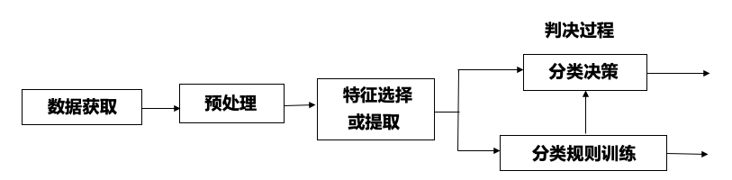

# 第一章 绪论

## 1.1 模式和模式识别的概念

* 模式
    * 对客体特征的描述，是取自客观世界的某一样本的测量值的集合
* 模式识别
    * 确定一个样本的类别属性的过程，即把某一样本归属于多个类型中的某个类型
* 样本
    * 一个具体的研究对象
* 特征
    * 描述模式特征的量
    * 一定是具体的数值
* 模式类
    * 具有某些共同特性的模式的集合

## 1.2 模式识别系统

### 模式识别系统框图

### 模式识别系统各部分的功能

* 数据获取
    * 用数字符号来表示所研究的对象
* 预处理
    * 去噪声
    * 数据完善
* 特征选择或提取
    * 对原始数据进行变换，得到最能反应分类本质的特征
* 分类决策
    * 在特征空间中用模式识别的方法把被识别对象归为某一类别
    * 基本做法
        1. 确定判决规则
        2. 按规则分类时，错误率最小或损失最小
* 分类规则训练
    * 通过对样本的学习，调节分类规则中的参数
    * 基本做法
        1. 输入样本
        2. 使用现有参数对样本进行识别，计算识别误差，根据误差调节参数

## 1.3 模式识别概述

* 统计模式识别
    * 采用概率论和数理统计的方法。采用判别函数，使得误判概率最小
* 神经网络模式识别
    * 以人工神经元为基础，模拟人脑神经细胞的工作特点。对脑部工作的生理机制进行模拟，实现形象思维的模拟

### 按实现方法分类的模式识别系统

* 监督学习
    * 利用判别函数进行分类判别。需要有足够的先验知识
* 非监督学习
    * 用于没有先验知识的情况下，通常采用聚类分析的方法
* 强化学习
    * 赏罚分明、训练网络+判决网络

# 第二章 聚类分析

## 2.1 聚类分析的概念

* 聚类分析
    * 根据模式样本之间的相似性对模式样本进行分类
* 前提条件
    * 样本所属类别未知
* 目标
    * 将相似的样本归为一类，不相似的样本归为不同类
* 关键问题
    * 特征选择
        * 略去多余的特征，选择合适的特征
    * 特征量化
        * 连续量的量化
        * 数量级标准化
        * 特征权重
        * 归一化

## 2.2 相似性测度和聚类准则

### 欧式距离

$$
D(X_1, X_2)=\sqrt{(X_1-X_2)^T(X_1-X_2)}
$$

* 要求
    * 各维度上是相同的物理量
    * 各维度上的物理量单位相同
* 问题
    * 单位或物理量不同时会出现不同的聚类结果
* 解决方法
    * 标准化
    * 归一化
* 优点
    * 多个维度为同一个物理量且单位相同时，效果很好
* 缺点
    * 多个维度为不同物理量时，需要归一化
    * 多个维度为不同单位时，需要标准化

### 马氏距离

$$
D=\sqrt{(X-M)^TC^{-1}(X-M)}
$$

* 要求
    * 各维度上可以是不同的物理量
    * 各维度上物理量的单位可以不同
* 优点
    * 可以消除量纲的影响
    * 可以排除多个维度特征之间的关联
* 缺点
    * 要求总体样本数量大于每个样本的维数，否则协方差矩阵不存在逆矩阵

### 明氏距离

$$
D_m(X_i, X_j)=\left(\sum_{k=1}^n|x_{ik}-x_{jk}|^m\right)^{\frac{1}{m}}
$$

* 要求
    * 各维度上是相同的物理量
    * 各维度上的物理量单位相同
* 问题
    * 单位或物理量不同时会出现不同的聚类结果
* 解决方法
    * 标准化
    * 归一化
* 优点
    * 多个维度为同一个物理量且单位相同时，效果很好
* 缺点
    * 多个维度为不同物理量时，需要归一化
    * 多个维度为不同单位时，需要标准化

### 汉明距离

* 要求
    * 各维度上是二维数据$\{-1, 1\}$
* 问题
    * 不是二维数据
    * 不是-1和1
* 解决方法
    * 二值化
    * 码型变换
* 优点
    * 能很好的反映两个二值样本的相似程度
    * 与单位无关
    * 与物理量无关
* 缺点
    * 维度数据不是二值时，需要二值化
    * 维度数据不是-1或1时，需要码型变换

### 角度相似函数

$$
S(X_i, X_j)=\frac{X_i^TX_j}{||X_i||\cdot||X_j||}
$$

* 要求
    * 各维度上是相同的物理量
    * 各维度上的物理量单位相同
* 问题
    * 单位或物理量不同时会出现不同的聚类结果
* 解决方法
    * 标准化
    * 归一化
* 优点
    * 多个维度为同一个物理量且单位相同时，效果很好
    * 具有旋转不变性
    * 二值情况下和汉明距离类似
* 缺点
    * 多个维度为不同物理量时，需要归一化
    * 多个维度为不同单位时，需要标准化

## 算法

### 基于距离阈值的聚类

#### 近邻聚类法

* 优点
    * 计算简单、快速
* 缺点
    * 依赖于距离阈值的大小
    * 依赖于第一个聚类中心位置的选择
    * 依赖于待分类模式样本的排列次序
    * 依赖于样本分布的几何性质

#### 最大最小距离法

* 优点
    * 计算简单、快速（比近邻聚类慢些）
    * 不依赖于待分类模式样本的排列次序
* 缺点
    * 依赖于距离阈值的大小
    * 依赖于第一个聚类中心的位置选择
    * 依赖于样本分布的几何性质

##### 为什么要找出最小距离集合

因为只有当最小距离离现有聚类中心都很远的话，这个点才是离所有现有聚类中心都很远，才可能成为新聚类中心。否则，如果计算最大距离的话，有些点虽然离个别中心远，但是离其他中心很近，不应该作为新中心。

### 动态聚类

#### K-均值算法

* 优点
    * 算法简单高效
* 缺点
    * 结果受初始聚类中心位置影响
    * 结果受聚类中心个数影响
    * 结果受模式样本几何性质影响
    * 结果受样本顺序影响
* 解决办法
    * 试探不同的$K$值
        * 准则函数特点
            * 随$K$值增大而减小
            * 到达合理$K$值前会急剧下降
            * 到达合理$K$值后会平稳下降
        * 逐步增加$K$值来试探
    * 选择不同的初始聚类中心

#### ISODATA算法

* 优点
    * 聚类中心个数可调
    * 初始聚类中心位置对结果影响较小
* 缺点
    * 结果受模式样本几何性质影响
    * 结果受样本顺序影响
    * 算法复杂

# 第三章 判别函数及几何分类法

## 3.1 判别函数

直接对模式进行分类的准则函数

### 前提条件

* 样本所属类别未知
* 样本类别数已知

### 目标

根据判别函数的计算结果直接将模式样本分类

### 与聚类准则函数的区别

* 聚类准则函数用于度量模式间的相似性；判别函数用于判断样本属于哪一类（即决策）
* 聚类准则函数取极值，代表聚类达到最优解；判别函数的取值直接决定样本的类别

## 3.2 线性判别函数

### 一般形式

$$
d(X)=W_0^TX+w_{n+1}
$$

其中$X=(x_1, x_2,\ldots, x_n)^T$, $W_0=(w_1, w_2, \ldots, w_n)^T$

#### 增广向量形式

$$
d(X)=W^TX
$$

其中$X=(x_1, x_2, \ldots, x_n, 1)^T$, $W=(w_1, w_2,\ldots, w_{n+1})^T$

### 二分类的分类方法

* 若$d(X)>0$, 则$X\in\omega_1$
* 若$d(X)<0$, 则$X\in\omega_2$
* 若$d(X)=0$, 则不可判别，可以随意归属或拒绝

### 多分类的分类情况

#### $\omega_i/\overline{\omega_i}$两分法

##### 判别函数

* 若$X\in\omega_i$, 则$d_i(X)>0$
* 若$X\notin \omega_i$, 则$d_i(X)<0$

将某个待分类模式$X$分别代入$M$个类的$d(X)$中，若只有$d_i(X)>0$, 其他$d(X)<0$, 则判为$\omega_i$类

##### 核心思想

将$M$个多类问题分为$M$个两类问题，识别每一类均需$M$个判别函数。识别出所有的$M$类仍是这$M$个函数

##### 对模式的线性可分的可能性

小（有待定区）

#### $\omega_i/\omega_j$两分法

##### 判别函数

$$
d_{ij}(X)=W_{ij}^TX
$$

其中$d_{ji}=-d_{ij}$

若$X\in\omega_i$, 则$\forall j\neq i, d_{ij}(X)>0$

在$M$类模式中，以下标$i$开头的$M-1$个判决函数全为正时，$X\in\omega_i$. 其中若有一个为负，则拒绝

##### 核心思想

要分开$M$类模式，共需$\frac{M(M-1)}{2}$个判决函数

##### 对模式的线性可分的可能性

大（有待定区）

#### $\omega_i/\omega_j$两分法特例

##### 判别函数

$$
d_{ij}(X)=d_i(X)-d_j(X)
$$

##### 核心思想

* 除边界外，没有不确定区域
* 把$M$类情况分成了$\frac{M(M-1)}{2}$个两类问题，并且$\omega_i$类的判别界面全部与$\omega_j$类的判别界面相邻

##### 对模式的线性可分的可能性

大（无待定区）

## 3.3 广义线性判别函数

## 3.4 线性判别函数几何性质

### 基本概念

#### 模式空间

以$n$维模式向量$X$的$n$个分量为坐标变量的欧式空间

#### 线性分类

用$d(X)$进行分类，相当于用超平面$d(X)=0$把模式空间分成不同的决策区域

#### 法向量

垂直于超平面的向量，方向由超平面的负侧指向正。

超平面的法向量就是判别函数的权向量

#### 权空间

以线性判别函数的权值为坐标变量的$n+1$维欧式空间称为权空间

## 3.5 感知器算法

$$
W(k+1)=\begin{cases}W(k)&W^T(k)X_i>0\\W(k)+cX_i&W^T(k)X_i\leq 0\end{cases}
$$

### 核心思想

赏罚过程

### 收敛性

收敛条件：模式类别线性可分

## 3.6 梯度法

$$
W(k+1)=W(k)-c\cdot\left.\frac{\partial J(W, X_i)}{\partial W}\right|_{W=W(k)}
$$

### 基本思想

使用梯度下降的方法求准则函数的极小值

### 准则函数选取规则

* 具有唯一的最小值，并且这个最小值发生在$W^TX_i>0$时
* 对错误分类敏感

### 讨论

#### 收敛性

算法必收敛

#### 步长

若步长太小，则收敛太慢，若太大，又可能过头，甚至引起发散

#### 准则函数

梯度算法利用准则函数$J(W, X)$来调节权向量，$J(W, X)$形式不同，算法也不同

### 固定增量算法

取准则函数
$$
J(W, X)=\frac{1}{2}(|W^TX|-W^TX)
$$
梯度
$$
\nabla J=\begin{cases}X&W^TX>0\\-X&W^TX<0\end{cases}
$$
与感知器算法相同

## 3.7 最小平方误差算法

准则函数
$$
J(W, X, B)=\frac{1}{2}||XW-B||^2
$$
优势

* 对线性可分的模式收敛
* 能检测不可分的模式

# 第四章 基于统计决策的概率分类法

## 4.1 研究对象及相关概率

### 先验概率$P(\omega_i)$

根据以前的知识和经验得出的$\omega_i$类样本出现的概率

### 后验概率$P(\omega_i\mid X)$

根据一批实验样本$X$统计出的$\omega_i$类出现的概率

### 条件概率$P(X|\omega_i)$

已知属于$\omega_i$类的样本$X$, 发生某种事件的概率

## 4.2 贝叶斯决策

### 最小错误率贝叶斯决策

取$P(\omega_i\mid X)$最大的

等价于取$p(X\mid \omega_i)P(\omega_i)$最大的

可以通过似然比$l_{12}=\frac{p(X\mid\omega_1)}{p(X\mid\omega_2)}$与$\frac{P(\omega_2)}{P(\omega_1)}$比较来判断

### 最小风险贝叶斯决策

取
$$
r_i=\sum_{j=1}^ML_{ij}(X)P(\omega_j\mid X)
$$
最小的

可以通过似然比$\theta_{12}=\frac{(L_{12}-L_{22})P(\omega_2)}{(L_{21}-L_{11})P(\omega_1)}$与$\frac{p(X\mid\omega_1)}{p(X\mid\omega_2)}$比较来判断

### 正态分布模式的贝叶斯决策

#### 多变量正态随机变量

$$
p(X)=\frac{1}{(2\pi)^{n/2}|C|^{n/2}}\exp\{-\frac{1}{2}(X-M)^TC^{-1}(X-M)\}
$$

## 4.3 错误率

### 定义

$$
P(e)=\int_{-\infty}^{\infty}P(e\mid X)p(X)dX
$$

### 两类问题的错误率

$$
P(e)=P(\omega_1)\int_{R_2}p(X\mid\omega_1)dX+P(\omega_2)\int_{R_1}p(X\mid \omega_2)dX
$$

### 错误率的估计

#### 已设计好分类器时错误率的估计

##### 先验概率未知

随机抽样

设$\epsilon$为真实的错误率；则随机抽取$N$个样本，假设分类器错分样本数为$k$, 则可以用公式$\epsilon'=\frac{k}{N}$来估计$\epsilon$

##### 先验概率已知

选择性抽样

设$\epsilon$为真实的错误率，先验概率为$P(\omega_i)$；则根据分类器的分类结果，从$\omega_i$中抽取$N_i=P(\omega_i)N$个样本，用公式$\epsilon'=\sum_{i=1}^nP(\omega_i)\frac{k_i}{N_i}$来估计$\epsilon$

#### 未设计好分类器时错误率的估计

对样本进行划分，决定哪些用于设计分类器，哪些用于检验分类器的错误率

## 4.4 聂曼-皮尔逊

### 贝叶斯决策的问题

要求事先知道先验概率$P(\omega_i)$和损失函数$L_{ij}(X)$; 当无法获得先验概率和损失函数时，无法使用贝叶斯决策

### 基本思路

在$P_2(e)$为常数的条件下，使$P_1(e)$最小，以此确定阈值

# 第五章 特征选择与特征提取

## 5.1 基本概念

### 特征选择

从$n$个度量值集合中，按某一准则选出$m$供分类用的子集，作为降维的分类特征

### 特征提取

使$n$个度量值通过某种变换，产生$m$个特征，作为新的分类特征

### 必要性

* 去除不必要的特征
* 凸显重要特征
* 特征维数灾难
* 提高分类效率

### 总体目标

使用有价值的特征，使分类器实现快速、准确和高效的分类

## 5.2 类别可分测度

### 要求

* 测度与误判概率有单调关系
* 当特征相互独立时，判据具有可加性
* 具有距离特性
    * 当$i\neq j$时，$J_{ij}>0$
    * 当$i=j$时，$J_{ij}=0$
    * $J_{ij}=J_{ji}$
* 对特征数目是单调不减的

### 基于距离的可分性测度

#### 原则

* 区域重叠的部分越小或完全没有重叠，类别可分性越好
* 当类内模式较密聚，而不同类的模式相距较远时，类别可分性较好

#### 散布矩阵

$$
S_t=S_b+S_w
$$

### 基于概率分布的可分性测度

散度
$$
J_D=J_{ij}=\int_X(p(X|\omega_i)-p(X|\omega_j))\ln\frac{p(X|\omega_i)}{p(X|\omega_j)}dX
$$
当两类都是正态分布时
$$
J_{ij}=\mathrm{tr}((M_i-M_j)^TC^{-1}(M_i-M_j))
$$

## 5.3 单类模式特征提取

### 基本思路

* 类内距离变小
* 迹变小
* 特征值之和变小
* 去掉大的特征值

### 特点

* 特征不变
* 类内距离变小
* 便于分类

## 5.4 K-L变换

* 优点
    * 保留了特征
    * 突出了类间差异
    * 消除了相关性
* 缺点
    * 类别多时效果差
    * 需要较多样本
    * 计算较慢

## 5.5 特征选择

分支定界

# 第八章 神经网络模式识别法

## 8.2 神经网络基本概念

调权表达式不要求

## 8.3 前馈神经网络

### 基本思路

1. 正向传播阶段
    1. 输入数据经每层处理后逐层向后传递结果
    2. 每层的输出只影响下一层，最终达到输出层
    3. 如果输出结果不理想，则调用反向传播
2. 反向传播阶段
    1. 误差信号按原路返回
    2. 每层按照误差信号修改权值，使误差达到最小

### 主要问题

* 收敛速度慢
* 只能收敛于局部最优解，不能保证收敛于全局最优解
* 泛化能力差

### 和反馈神经网络的比较

* 前馈神经网络
    * 分层结构
        * 有明显层次，信息流由输入层到输出层
* 反馈神经网络
    * 相互连接结构
        * 没有明显层次，任意两个神经元之间可达，具有输出单元到隐层单元或输入单元的反馈连接