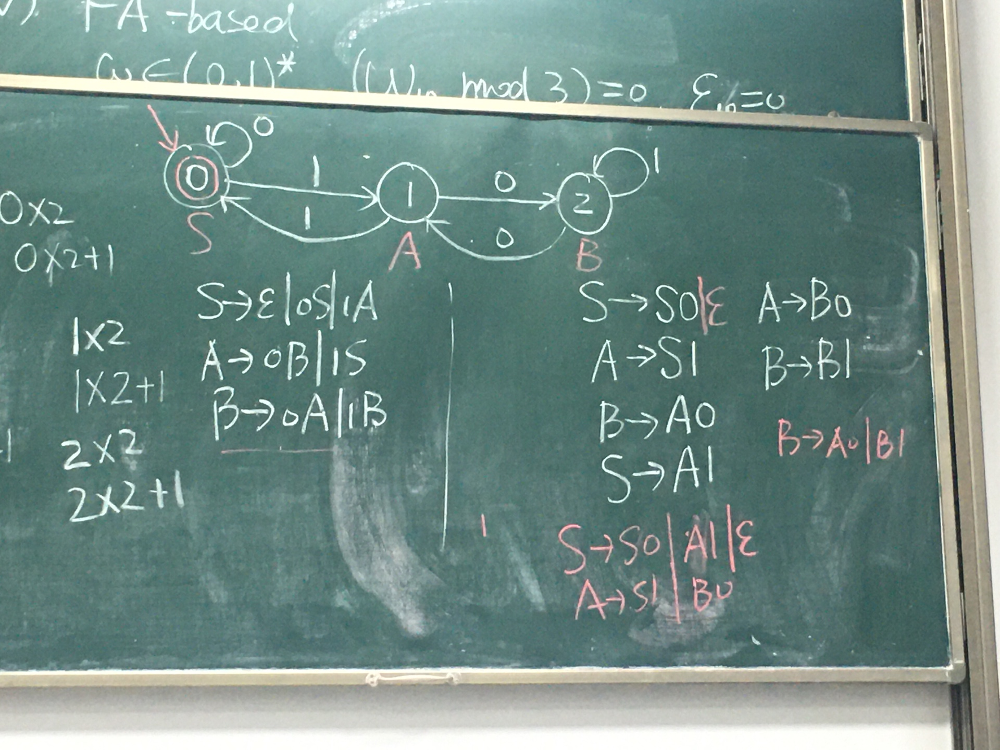
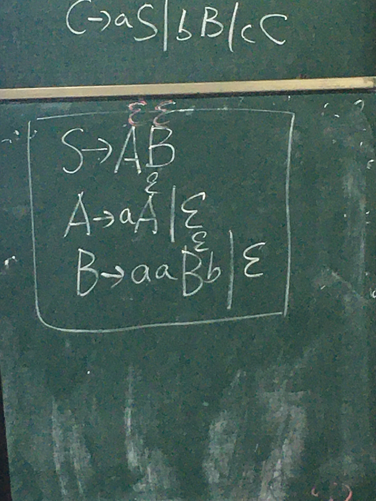
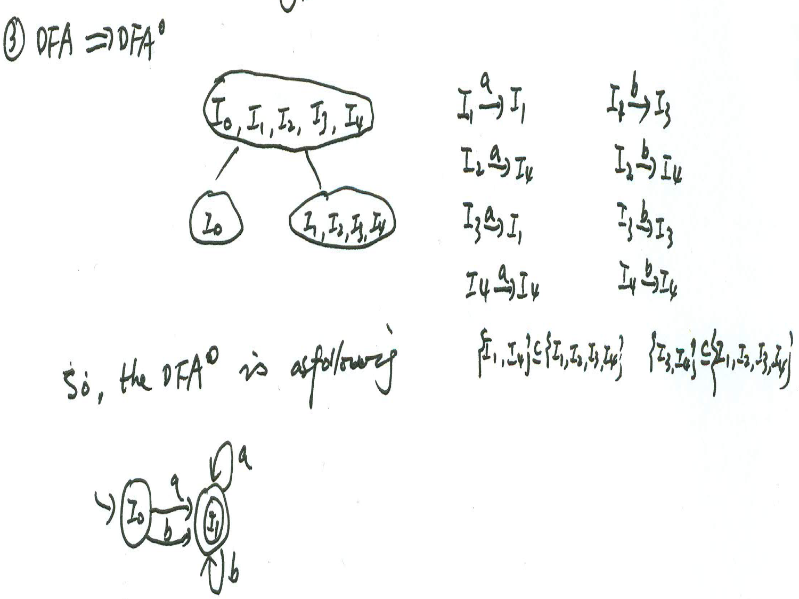
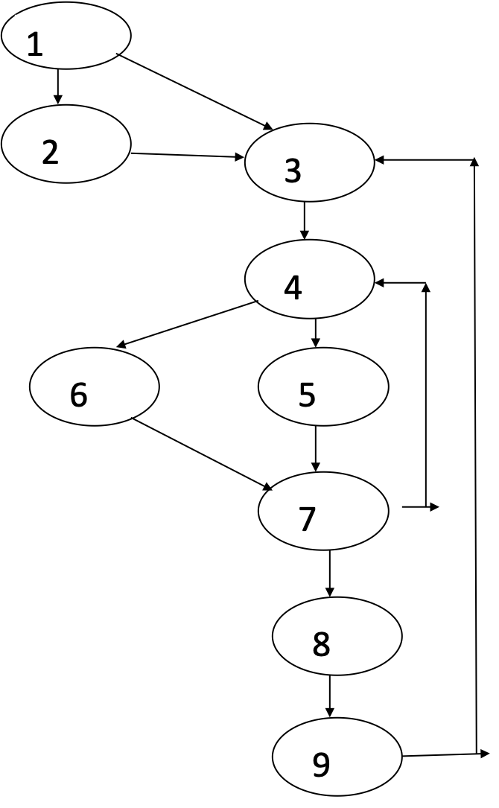

# 编译的五个关键

## Analyse

### Syntax

判断是否合法

#### lexical

#### syntactic

### Semantic

判断是否合理

#### static

第五章、第六章

#### dynamic

第七章(Runtime environment)

## Translation

.c ----- syntax-directed -----> .TAC

## Optimaztion

optimaztion of TAC

## Fundamental

第二章

### Grammar

### FA

# Chapter 2

## Chomsky Grammar and related Automation

langauge ---- By experience ----> context-free grammar

## Construct a context-free grammar without $\epsilon$-production from a language

### Construct a context-free grammar

#### symmetrical method

1. Find out symmetrical axis (special case)
2. Find out symmetrical propeties


#### Stepwise Refinement Method

子问题之间需要具有独立性(指数之间没有关系)

##### Top-down refinement


##### Left-right refinement


##### refine after transform


#### Equivalent Method

There are same propeties in the two sides of a production

#### Circuit State Transfer Diagram Method

odd-even problem

1. Draw out the circuite state transfer diagram<br />关心$n$个符号的奇偶性，不关心剩下$m$个符号的奇偶性，则需要用$n$bit来表示，共$2^n(n+m)+1$个产生式
2. Determine the statr state and end state<br />将全0的状态作为特殊考虑
    * 将其作为终态，确定初态
    * 将其作为初态，确定终态
3. Name each states with Nonterminals
4. Write out the related productions<br />From $S$, each edge corresponds to a prodcution; For end state, add $\epsilon$-production


__在画状态转换图的时候，一定要画“上帝之手”。__

#### FA-based Method




#### Hybrid Method

$$
L=\{\omega\mid\omega\in(a, b, c, d)^*, \text{the number of a, b, d are odd, and starts with a, ends with d}\}
$$


### Optimization of a grammar

#### Eliminate useless productions

* A -> A
* 不能由开始符推出，或者不能推出终结符序列

#### Eliminate $\epsilon$-production

1. Find out all $\epsilon$-production<br />Construct $V_0=\{A\mid A\Rightarrow\epsilon, A\in V_N\}$ by iteration:
    1. $V_0'$: 直接推出$\epsilon$的非终结符
    2. $V_0''$: 将$V_0'$内的非终结符用$\epsilon$替代后，能推出$\epsilon$的非终结符，并上$V_0'$
    3. 判断$V_0$是否发生改变
2. Rewrite the related productions
3. Elminate all $\epsilon$-productions except for $S\to\epsilon$, for $S\to\epsilon$, let $S'\to S, S'\to\epsilon$




# Chapter 3

## Conversion from NFA to DFA

table driven

### $\epsilon$-edge

$\epsilon$-closure

### more following states

subset construction

## Minimizing of DFA

Top-down equivalent class division

1. divide by is-end
2. divide by state equivalence:
    * 发出边数相同
    * 后继状态在同一等价类（弱等价：属于同一个叶节点）
3. lookback problem

__一定要加初态的进入边和终态标记__

## Conversion from Regular expression to NFA and inverse conversion

### Top-down stepwise refinement


### Bottom-up combination (Thompson algorithm)

1. RE infix -> RE postfix
2. 从最小字符的自动机组合大的自动机


## Conversion from Regular Grammar to NFA and inverse conversion

## Construct a minimum-state DFA for a regular expression

$$
((ab^*)(a|b)^*)^*(a|b)(a|b)^* 
$$




# Chapter 4

parse tree construction: 

* top-down from S (derivation-based)<br/>Predictive parsing method
* button-up from instance s (reduction-based)<br />LR parsing method

## Top-down parsing

### Recursive descent parsing

### Predictive parsing

LL(1)

### LL(1) parsing table construction

#### 1. preprocess

1. extract maximum common left factor
2. eliminate left recursion
    * Direct
        
    * Indirect<br />precedence-based
        
    * Hybrid<br />from inner to outer, from left to right
        
        

#### 2. First & Follow

$$
\mathrm{first}(\alpha)=\{a\mid\alpha\Rightarrow a\cdots, a\in V_T\}\\
\mathrm{follow}(A)=\{a\mid\alpha\to Aa\cdots, a\in V_T\}
$$

##### Follow(A) evaluation

* $B\to\alpha A\beta$
    * $\beta\not\Rightarrow \epsilon$<br />$\mathrm{first}(\beta)\Rightarrow\mathrm{follow}(A)$
    * $\beta\to\epsilon$<br />$(\mathrm{first}(\beta)-\{\epsilon\})\cup\mathrm{follow}(B)\Rightarrow \mathrm{follow(A)}$
* $B\to\alpha A$<br />$\mathrm{follow}(B)\Rightarrow\mathrm{follow}(A)$
* $\$_R\in\mathrm{follow}(S)$

## bottom-up parsing (LR parsing)

preprocessing: add $S'\to S$

### SLR(1)

LR Item: nameing states in layered FA

G + (0) => G' => LR DFA => LR parsing table

#### construction of LR DFA

* in-state ext
* between-state ext

可以采用分块画法画DFA

#### from LR DFA to SLR parsing table

from $I_0$ watch each state

* outer edge
    * $V_N$ -> goto
    * $V_T$ -> action
* inner
    * reducible LR item

### LR(1)

LR(1) item = LR item + predictive symbol

### LALR(1)

### Summary

|        | start point       | in-state ext                                                 | between-state ext                 | reducible item deal                        |
| ------ | ----------------- | ------------------------------------------------------------ | --------------------------------- | ------------------------------------------ |
| SLR(1) | $S'\to.S$         | if $\beta\to\alpha .A\beta\in I_i$, then $A\to.\gamma\Rightarrow I_i$ | shift dot                         | $A\to \alpha.$, $\mathrm{follow}(A)$       |
| LR(1)  | $(S'\to S, \$_R)$ | if $(\beta\to\alpha.A\beta, a)\in I_i$, then $(A\to.\gamma, \mathrm{fist}(\beta a))\Rightarrow I_i$ | shift dot, same predictive symbol | $(A\to\alpha., a|b)$, $(a, b)\Leftarrow r$ |


## Ambiguous grammar parsing

* associativity and precedence
* dangle rule

# Chapter 5

## Attribute

## Annotated parsing tree

### construct an annotated parsing tree for an expression

## syntax-directed definition

## S-attribute grammar and evaluation of S-attribute

### construct semantic rules for a S-attribute grammar

# Chapter 7

Stack-based stroage allocation

## Construct a maximum stack map for a C recursive program

1. construct the activation tree tre represent call relations among functions
2. construct the stack layout at maximum size according to the largest path from the root to the leaves in the activation tree
3. Detailing each block in activation record

# Chapter 8

## TAC

## Quadruple

## Bottom-up sytax-directed program translation

### assignment statement with array

### `if` and `while` statement

#### short-circuit code


#### backpatching

1. remember
2. merge
3. backpatching


### Translate a program fragment into TAC or quadruple using bottom-up syntax-directed program translation method

# Chapter 9

## Block division

### construct a flow graph from TAC statements sequence

## Optimization in a block

### constant folding

### common sub-expression

### copy-propagation

### DAG

### code rewriting

### optimize a block in DAG method and rewrite the code

1. Construct the DAG to represent data relations among data objects in the block
    * bottom-up
2. Optimize the DAG, get optimized DAG
    1. bottom-up constant folding
    2. multiple tags -> one tag
    3. delete useless nodes
3. Construct the herustic order of the non-leaves of optimized DAG<br />by topological sorting, and always select the leftmost
4. Rewrite code sequence according to the __reverse herustic order__

### 样题

```
T1 = S + R
T2 = S * R
A = T1 + T2
T3 = 2
T4 = 10 / T3
B = T4
T5 = S + R
T6 = T4 * 5
A = T6
```

#### DAG


#### Optimized DAG


## Loop seeking

### back edge

### Find out the loop in a flow graph using dominators and back edge

1. find out back edges
    1. construct the DOM(n)
    2. find out back edges<br />if $n\to d$ is an edge, $d\in\mathrm{DOM}(n)$, then $n\to d$ is called a back edge
2. find out all loops



